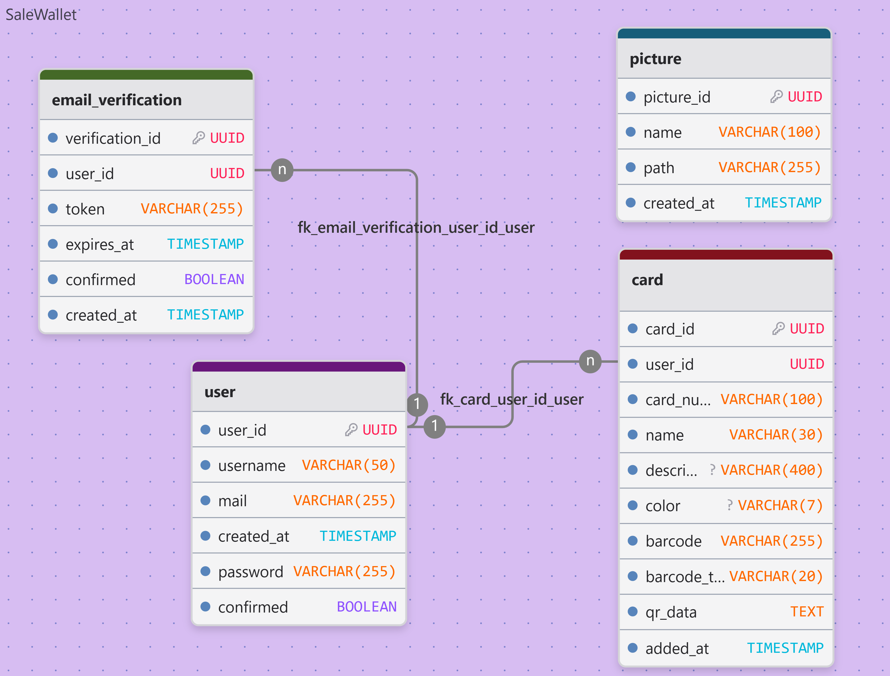
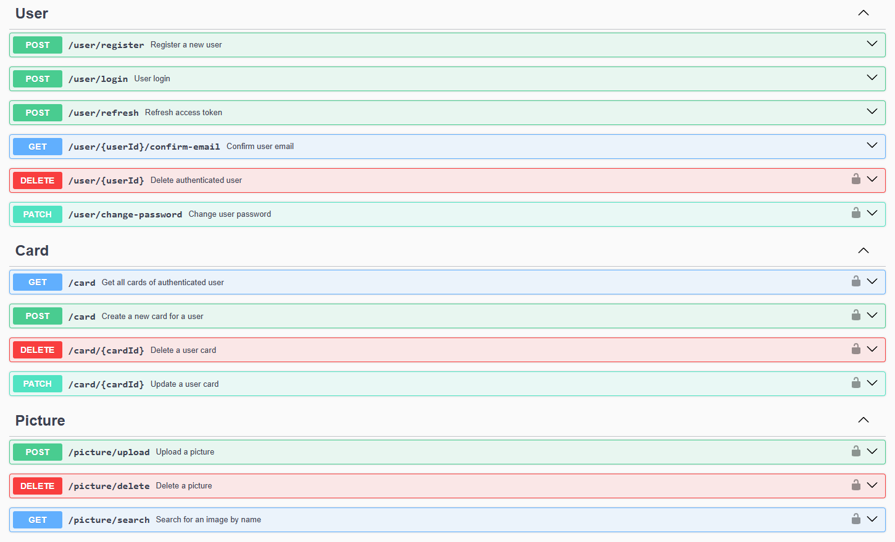

           

# ⚒️ API for the SaleWallet cardholder mobile app

# Description

SaleWallet Backend is a server-side REST API written in TypeScript for a local wallet application for cardholders. It handles user logic, card management, transactions, security, and database interaction.

Technology stack: __Node.js, Express, TypeScript, PostgreSQL, Sequelize (ORM), Swagger, JWT, bcrypt, husky, biome, nodemailer, winston, nginx, PM2__

# Docs

### Table of Contents
1. [Project structure](#1-project-structure)
2. [Data schema](#2-data-schema)  
  2.1. [Database type](#database-type)  
  2.2. [Table structure](#table-structure)  
  2.3. [Relationships](#relationships)  
  2.4. [Database diagram](#database-diagram)  
3. [Endpoint description](#3-endpoint-description)  
  3.1. [User endpoints](#-user)  
  3.2. [Card endpoints](#-card)  
  3.3. [Picture endpoints](#-picture)  
  3.4. [Other endpoints](#-other)  
  3.5. [Swagger](#swagger-documentation)  
4. [Environment variables](#4-environment-variables)
5. [Creating a database](#5-creating-a-database)   
5.1 [Installing Postgresql](#51-installing-postgresql)  
5.2 [Creating a user and database](#52-creating-a-user-and-database)  
5.3 [Changing the configuration](#53-changing-the-configuration)  
6. [Manual application deployment](#6-manual-application-deployment)  
  6.1. [NodeJS installation](#61-nodejs)  
  6.2. [Git installation and cloning](#62-git)  
  6.3. [Application build and startup](#63-building)  
  6.4. [Nginx server setup](#64-nginx-server)  
  6.5. [Secure Nginx with Let's Encrypt](#65-secure-nginx-with-lets-encrypt)


## 1. Project structure

```bash
src/
├── config/         # Configuration files (database, mail, logging)
├── controllers/    # Request handlers (routes)
├── errors/         # Error descriptions for controllers
├── html/           # HTML templates
├── middleware/     # Middleware (e.g. auth check, logger)
├── models/         # Sequelize models for DB tables
├── routes/         # Express Route Definitions
├── services/       # Application business logic
├── swagger/        # Swagger documentation configuration
├── tests/          # Described JEST tests
├── types/          # Data types for controllers and models
├── utils/          # Helper functions (error handling, sending emails)
├── app.ts          # Main application file
└── index.ts        # Server initialization
```

## 2. Data schema

- [Database Type](#database-type)
- [Table Structure](#table-structure)
  - [user](#user)
  - [card](#card)
  - [email_verification](#email_verification)
  - [picture](#picture)
- [Relationships](#relationships)
- [Database Diagram](#database-diagram)

### Database type

- **Database system:** PostgreSQL
- **ORM:** Sequelize ORM

### Table structures

### user

| Name        | Type          | Settings                      |
|-------------|-----------------------------------------------|--------------------------------------------------------------|
| **user_id** | UUID | 🔑 PK, not null, unique |  |
| **username** | VARCHAR(50) | not null, unique |  |
| **mail** | VARCHAR(255) | not null, unique |  |
| **password** | VARCHAR(255) | not null |  |
| **confirmed** | BOOLEAN | not null, default: FALSE |  |
| **created_at** | TIMESTAMP | not null, default: CURRENT_TIMESTAMP |  | 

### card

| Name        | Type          | Settings    | References  |
|-------------|---------------|-------------|-------------|
| **card_id** | UUID | 🔑 PK, not null, unique |  | 
| **user_id** | UUID | not null | fk_card_user_id_user | 
| **card_number** | VARCHAR(100) | not null, unique |  | 
| **name** | VARCHAR(30) | not null |  | 
| **description** | VARCHAR(400) | null |  | 
| **color** | VARCHAR(7) | null |  | 
| **barcode** | VARCHAR(255) | not null, unique |  | 
| **barcode_type** | VARCHAR(20) | not null |  | 
| **qr_data** | TEXT | not null, unique |  | 
| **added_at** | TIMESTAMP | not null, default: CURRENT_TIMESTAMP |  |

### email_verification

| Name        | Type          | Settings    | References  |
|-------------|---------------|-------------|-------------|
| **verification_id** | UUID | 🔑 PK, not null, unique |  |
| **user_id** | UUID | not null | fk_email_verification_user_id_user |
| **token** | VARCHAR(255) | not null, unique |  |
| **expires_at** | TIMESTAMP | not null |  |
| **confirmed** | BOOLEAN | not null, default: FALSE |  |
| **created_at** | TIMESTAMP | not null, default: CURRENT_TIMESTAMP |  |

#### Indexes

| Name | Unique | Fields |
|------|--------|--------|
| email_verification_index_0 |  | user_id, confirmed |

### picture

| Name        | Type          | Settings    | References  |
|-------------|---------------|-------------|-------------|
| **picture_id** | UUID | 🔑 PK, not null, unique |  |
| **name** | VARCHAR(100) | not null, unique |  |
| **path** | VARCHAR(255) | not null, unique |  |
| **created_at** | TIMESTAMP | not null, default: CURRENT_TIMESTAMP |  | 

### Relationships

- **email_verification to user**: many_to_one
- **card to user**: many_to_one

### Database Diagram




## 3. Endpoint description

Endpoints are accessible via a version-prefixed path: __{domain}/api/v1__

## 👤 User

| Method | Endpoint | Action | Auth | Description |
|-------|-----------|--------|------|-------------|
| `POST` | `/user/register` | Register a new user | 🚫 | Registers a new user with username, email, and password. Sends a confirmation email with a verification token. |
| `POST` | `/user/login` | User login | 🚫 | Authenticate user by username or email and password. Returns access and refresh tokens with user data including cards. |
| `POST` | `/user/refresh` | Refresh access token | 🚫 | Generates a new access token and refresh token using the refresh token from the Authorization header. |
| `GET` | `/user/{userId}/confirm-email` | Confirm user email | 🚫 | Confirms a user's email using the verification token. |
| `DELETE` | `/user/{userId}` | Delete authenticated user | ✅ | Deletes the authenticated user. Requires password confirmation. |
| `PATCH` | `/user/change-password` | Change user password | ✅ | Changes the password of the authenticated user. Requires old password verification. |

## 💳 Card

| Method | Endpoint | Action | Auth | Description |
|-------|-----------|--------|------|-------------|
| `GET` | `/card` | Get all cards of authenticated user | ✅ | Retrieves all cards associated with the authenticated user. Returns 404 if user not found or no cards. |
| `POST` | `/card` | Create a new card for a user | ✅ | Creates a new card associated with the authenticated user. |
| `DELETE` | `/card/{cardId}` | Delete a user card | ✅ | Deletes a card belonging to the authenticated user. |
| `PATCH` | `/card/{cardId}` | Update a user card | ✅ | Updates one or more fields of a card. barcode, barcode_type, and qr_data must be provided together if updating any of them. |

## 📁 Picture

| Method | Endpoint | Action | Auth | Description |
|-------|-----------|--------|------|-------------|
| `POST` | `/picture/upload` | Upload a picture | ✅ | Uploads a PNG or JPEG image to the server with a unique name. |
| `DELETE` | `/picture/delete` | Delete a picture | ✅ | Deletes images from the database and disk at the specified path. |
| `GET` | `/picture/search` | Searches for images by name using fuzzy search | 🚫 | Searches for images by name using fuzzy search. |

## 🗄 Other

| Method | Endpoint | Description | Auth |
|-------|----------|----------|----------------|
| `GET` | `/ (without version prefix)` | Returns the line: Server is running | 🚫 |
| `GET` | `/docs` | Swagger docs | 🚫 |

## Swagger documentation



## 4. Environment variables

```.env.example
# ===========================
# Server Settings
# ===========================
PORT=5500                 # The port on which the server runs

# ===========================
# Application Domain
# ===========================
DOMAIN=https://example.com       # Application domain

# ===========================
# Database Settings
# ===========================
DB_HOST=example-db.host.com      # Database host
DB_USER=dbuser                   # Database username
DB_PASSWORD=StrongPass123!       # Database password
DB_NAME=mydatabase               # Database name
DB_PORT=5432                     # Database port

# ===========================
# SMTP / Email Settings
# ===========================
SMTP_HOST=smtp.example.com           # SMTP server for sending emails
SMTP_PORT=587                        # SMTP server port
SMTP_USERNAME=user@example.com       # SMTP login username
SMTP_PASSWORD=StrongEmailPass!       # SMTP password
FROM_EMAIL_USERNAME=noreply@example.com # Email address used as sender

# ===========================
# Authentication Settings
# ===========================
AUTH_SECRET="random64characterstringforaccesstoken"          # Secret key for signing JWT access tokens
AUTH_SECRET_EXPIRES_IN=900                                    # Access token expiration time in seconds
AUTH_REFRESH_SECRET="another64characterstringforrefreshtoken" # Secret key for signing JWT refresh tokens
AUTH_REFRESH_SECRET_EXPIRES_IN=86400                           # Refresh token expiration time in seconds
```

## 5. Creating a database

### 5.1 Installing Postgresql

Before loading PostgreSQL, update the package lists:
```bash
sudo apt update
```

Download PostgreSQL with the postgresql-contrib utility:
```bash
sudo apt install postgresql postgresql-contrib
```

To start the DBMS, you need to run it as a service:
```bash
sudo systemctl start postgresql.service
```

Checking the service status:
```bash
sudo systemctl status postgresql.service
```
```bash
[sudo] password for user: 
● postgresql.service - PostgreSQL RDBMS
     Loaded: loaded (/usr/lib/systemd/system/postgresql.service; enabled; preset: enabled)
     Active: active (exited) since Thu 2026-01-29 17:56:24 MSK; 1 week 6 days ago
   Main PID: 53100 (code=exited, status=0/SUCCESS)
        CPU: 4ms

Jan 29 17:56:24 salewallet systemd[1]: Starting postgresql.service - PostgreSQL RDBMS...
Jan 29 17:56:24 salewallet systemd[1]: Finished postgresql.service - PostgreSQL RDBMS.
 systemctl start postgresql.service
```

### 5.2 Creating a user and database

Switch to the postgres user (created during DBMS installation):

```bash
sudo -i -u postgres
```

After this, we launch PostgreSQL (psql) and create a user, simultaneously setting a password for it:

```bash
postgres@salewallet:~$ psql
psql (16.11 (Ubuntu 16.11-0ubuntu0.24.04.1))
Type "help" for help.
```

> [!IMPORTANT]
> As an example, I will use the username - `user`, password - `password`, you need to enter your own secure data

```sql
CREATE USER 'user' WITH PASSWORD 'password';
```

Exiting the DBMS:

```bash
\q
```

Without leaving the PostgreSQL administrator account (postgres), let's create a database:

```bash
createdb salewallet
```

We go to the DBMS and grant the `user` all rights to the `salewallet` database:

```bash
psql
```

```sql
GRANT ALL PRIVILEGES ON DATABASE 'salewallet' TO 'user';
ALTER DATABASE 'salewallet' OWNER TO 'user';
```

```bash
\q
```

Log in to the `salewallet` database using the `user` account:

```bash
postgres@salewallet:~$ psql -U user -h 127.0.0.1 -p 5432 -d salewallet
Password for user user: 
psql (16.11 (Ubuntu 16.11-0ubuntu0.24.04.1))
SSL connection (protocol: TLSv1.3, cipher: TLS_AES_256_GCM_SHA384, compression: off)
Type "help" for help.
```

Check the database connection status using the `\conninfo` command:

```bash
salewallet=> \conninfo
You are connected to database "salewallet" as user "user" on host "127.0.0.1" at port "5432".
SSL connection (protocol: TLSv1.3, cipher: TLS_AES_256_GCM_SHA384, compression: off)
salewallet=> 
```

### 5.3 Changing the configuration

The database works locally, but if you try to connect via a different `IP`, the connection will not work. To do this, you need to modify the configuration files `postgresql.conf` and `pg_hba.conf`. They are located at `/etc/postgresql/<version>/main`.

In the `postgresql.conf` file, you need to change the `listen_addresses` parameter to `*` if you want requests from all `IP addresses` to pass through, or insert a specific `IP`:

```bash
listen_addresses = '*'      # what IP address(es) to listen on;
                                # comma-separated list of addresses;
                                # defaults to 'localhost'; use '*' for all
```

In the `pg_hba.conf` file, you need to modify the entry `host all all 0.0.0.0/0 scram-sha-256` at the end of the file. This will allow requests from all `IP addresses` during development. In production, you can change the `user`, `database`, and `IP address` to prevent external requests, or remove this entry if the database will be running locally.

```bash
# Database administrative login by Unix domain socket
local   all             postgres                                peer

# TYPE  DATABASE        USER            ADDRESS                 METHOD

# "local" is for Unix domain socket connections only
local   all             all                                     peer
# IPv4 local connections:
host    all             all             127.0.0.1/32            scram-sha-256
# IPv6 local connections:
host    all             all             ::1/128                 scram-sha-256
# Allow replication connections from localhost, by a user with the
# replication privilege.
local   replication     all                                     peer
host    replication     all             127.0.0.1/32            scram-sha-256
host    replication     all             ::1/128                 scram-sha-256

host all all 0.0.0.0/0 scram-sha-256
```

After changing the configuration files, you need to restart `postgresql`:

```bash
sudo systemctl restart postgresql
```

## 6. Manual application deployment

### 6.1 NodeJS

Get the latest updates first:

```bash
sudo apt-get update
```

Then install Node.js:

```bash
sudo apt-get install nodejs
```

To ensure that the software installation was successful, check the Node.js and npm versions:

```bash
node -v && npm -v
```

|  node   |   npm  |
|---------|--------|
| 22.22.0 | 11.8.0 |

> [!NOTE]
> If your major versions are the same or higher, you can skip the update step.

The versions must be no lower than those described above. If your versions are lower, then find out how to update them using the [link](https://timeweb.cloud/tutorials/nodejs/kak-ustanovit-node-js-v-ubuntu-22-04).

### 6.2 Git

Make sure Git is installed on Ubuntu:

```bash
git --version
```

If you don't have GIT, install it:

```bash
sudo apt install git
```

Clone the repository and go into it:
```bash
git clone https://github.com/BLazzeD21/Salewallet-backend.git

cd Salewallet-backend
```

Copy the environment variables from the example into the .env file, replace all variables with your own:

```bash
cp .env.template .env
```

### 6.3 Building

Installing dependencies:

```bash
npm install
```

Globally install the pm2 process manager:

```bash
npm install pm2 -g
```

Build and launch the application:

```bash
npm run build && npm run start:pm2
```

The application is running locally. To automatically restart the application when the server is started/restarted, enter:

```bash
sudo pm2 startup
sudo pm2 save
```

### 6.4 Nginx server

Install the `nginx` web server to configure a `proxy` for our local application and set it up on ports `80` and `443` with `SSL certificates`.

Installing Nginx on the machine:

```bash
sudo apt install nginx
```

After installation is complete, add the program to startup:

```bash
sudo systemctl enable nginx
```

Now you need to check that the web server is successfully installed and running, and that it's added to startup. Let's check the web server's operating status:

```bash
sudo service nginx status
```

The line `Active: active (running)...` indicates that the server is running successfully.

reate a site configuration file in the sites-available folder::

```bash
sudo nano /etc/nginx/sites-available/salewallet.conf
```

Paste the contents of the `nginx.conf` file, replacing the port and domain from `.env`:

```Nginx
server {
    listen 80 default_server;
    server_name {domain};

    location / {
        proxy_pass http://localhost:{port};

        proxy_set_header Host $host;
        proxy_set_header X-Real-IP $remote_addr;

        proxy_set_header X-Forwarded-For $remote_addr;
        proxy_set_header X-Forwarded-Proto $scheme;

    }
}
```

Create a link in the `sites-enabled` directory to the `salewallet` configuration to add it from the available list to the enabled list:

```bash
sudo ln -s /etc/nginx/sites-available/salewallet.conf /etc/nginx/sites-enabled/
```

After creating the virtual host, test the configuration:

```bash
sudo nginx -t
```

Expected result should be:

```bash
nginx: the configuration file /etc/nginx/nginx.conf syntax is ok
nginx: configuration file /etc/nginx/nginx.conf test is successful
```

Disable the default site by deleting the default virtual host entry:

```bash
sudo rm /etc/nginx/sites-enabled/default
```

Restart your nginx instance, with command:

```bash
sudo nginx -s reload
```

Check API accessibility:

```bash
curl -I "http://salewallet.blazzed.tech" 
```

It should output:

```bash
HTTP/1.1 200 OK
Server: nginx/1.24.0 (Ubuntu)
```

### 6.5 Secure Nginx with Let's Encrypt

Install Certbot and it’s Nginx plugin with `apt`:

```bash
sudo apt install certbot python3-certbot-nginx
```

Certbot provides a variety of ways to obtain SSL certificates through plugins. The Nginx plugin will take care of reconfiguring Nginx and reloading the config whenever necessary. To use this plugin, type the following:

```bash
sudo certbot --nginx -d example.com -d www.example.com
```

This runs `certbot` with the `--nginx` plugin, using `-d` to specify the domain names we’d like the certificate to be valid for.

If this is your first time running `certbot`, you will be prompted to enter an email address and agree to the terms of service. After doing so, `certbot` will communicate with the Let’s Encrypt server, then run a challenge to verify that you control the domain you’re requesting a certificate for.

If that’s successful, `certbot` will ask how you’d like to configure your HTTPS settings.

```bash
Output
Please choose whether or not to redirect HTTP traffic to HTTPS, removing HTTP access.
- - - - - - - - - - - - - - - - - - - - - - - - - - - - - - - - - - - - - - - -
1: No redirect - Make no further changes to the webserver configuration.
2: Redirect - Make all requests redirect to secure HTTPS access. Choose this for
new sites, or if you're confident your site works on HTTPS. You can undo this
change by editing your web server's configuration.
- - - - - - - - - - - - - - - - - - - - - - - - - - - - - - - - - - - - - - - -
Select the appropriate number [1-2] then [enter] (press 'c' to cancel):
```

Select your choice then hit `ENTER`. The configuration will be updated, and Nginx will reload to pick up the new settings. `certbot` will wrap up with a message telling you the process was successful and where your certificates are stored:

```bash
Output
IMPORTANT NOTES:
 - Congratulations! Your certificate and chain have been saved at:
   /etc/letsencrypt/live/example.com/fullchain.pem
   Your key file has been saved at:
   /etc/letsencrypt/live/example.com/privkey.pem
   Your cert will expire on 2020-08-18. To obtain a new or tweaked
   version of this certificate in the future, simply run certbot again
   with the "certonly" option. To non-interactively renew *all* of
   your certificates, run "certbot renew"
 - If you like Certbot, please consider supporting our work by:

   Donating to ISRG / Let's Encrypt:   https://letsencrypt.org/donate
   Donating to EFF:                    https://eff.org/donate-le
```

Your certificates are downloaded, installed, and loaded. Try reloading your website using `https://` and notice your browser’s security indicator. It should indicate that the site is properly secured, usually with a lock icon. If you test your server using the [SSL Labs Server Test](https://www.ssllabs.com/ssltest/), it will get an **A** grade.


